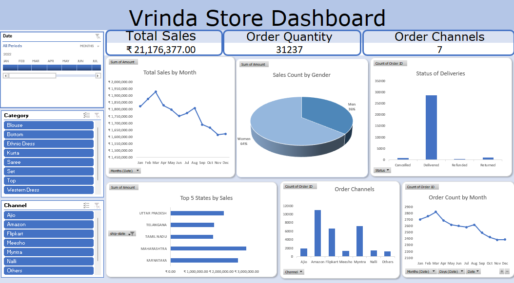
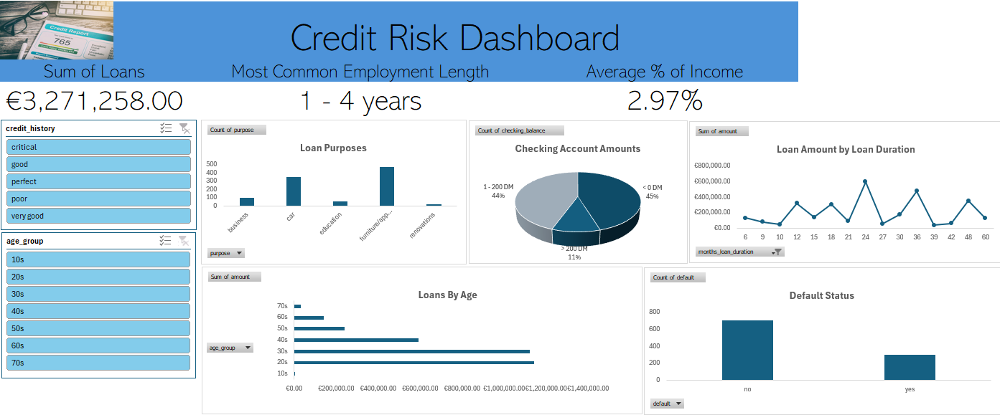
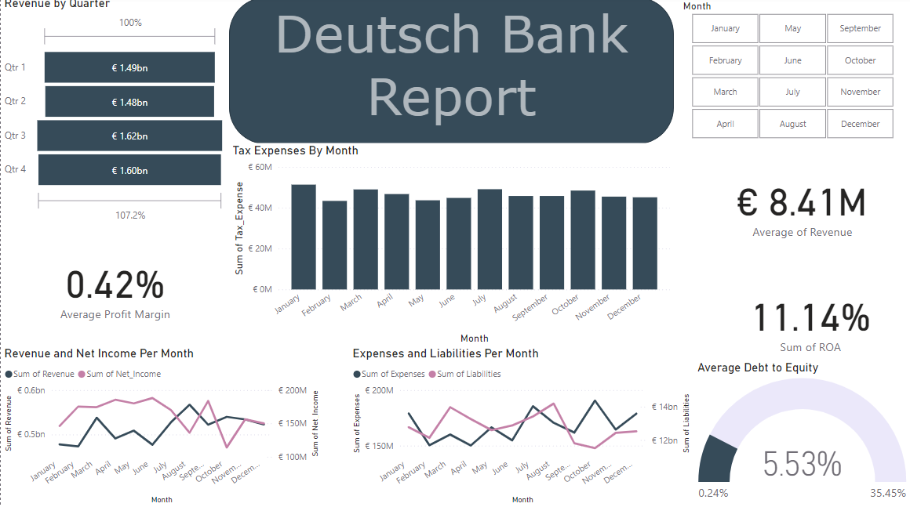
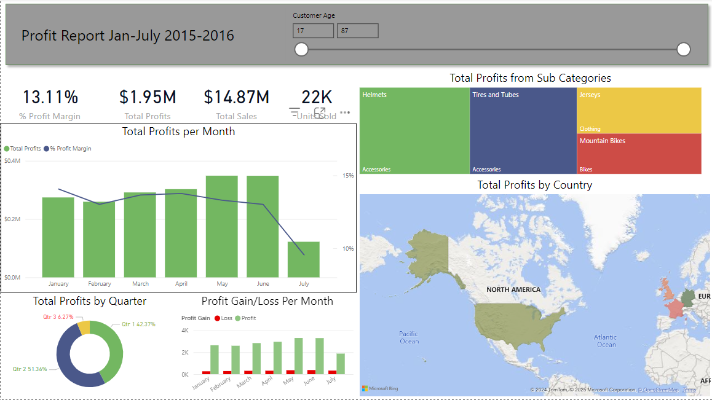
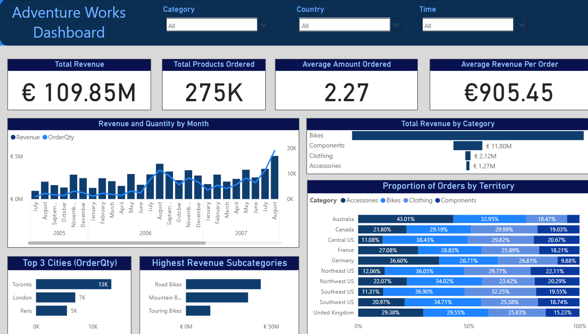

# Excel Project 1

**Title:** [Vrinda Store Report](https://github.com/StephenAdetobi/StephenAdetobi.github.io/blob/main/Vrinda%20Dashboard.xlsx)

**Tools Used:** PivotTable, PivotChart, AGGREGATE function, GETPIVOTDATA, Timeline, Slicers, Filters, Data Cleaning (UPPER, Column Editing, PROPER, TRIM)

**Project Description:** This project involved analysing product data of Vrinda to identify trends and patterns in sales performance for 2022. It is designed to provide a comprehensive overview of key performance metrics. This dashboard allows stakeholders to easily monitor and analyze the company’s performance throughout different demographics and across different channels. The dashboard includes the following features:

_Total Sales and Orders_: A total of the sales and orders made by the company, filterable by slicers and the timeline.

_Order Channels_: A total of the channels the company uses to order, filterable by slicers and the timeline.

_Total Sales/Order Count by Month_: Displays the monthly profit, as well as the count of sales by month, allowing for easy comparison of profitability throughout the year.

_Sales Count by Gender_: The total sales made by the company, split by gender.

_Status of Deliveries_: The distribution of delivery statuses for each product, categorised by "Cancelled", "Delivered", "Refunded" and "Returned".

_Top 5 Sales by States_: The top profitable states for Vrinda, alterable via filters.

Additionally, the dashboard includes interactive slicers and timeline for:

_Month_: Filter the data to view performance for a certain month.

_Dress_: Drill down into the performance of individual dresses.

_Channels_: View the performance metrics of specific delivery channels and their profitability.

**Key findings:**

_Sales Audience_: Identified the primary audience of Vrinda, allowing for shifts in marketing campaigns and advertising/

_Monthly Metrics_: Revealed changes in profitability across the year, aiding in inventory management and marketability.

_Regional Profitability_: Highlighted the states that drove profits the most for each dress category and channel, allowing for more strategic planning.

This dashboard proved to be invaluable for the company's management team for its help with showcasing clear, concise insights that helped with driving decision-making in a way that is easy to navigate for future projects.

**Dashboard Overview:** 

# Excel Project 2

**Title:** [Credit Risk Dashboard](https://github.com/StephenAdetobi/StephenAdetobi.github.io/blob/main/Credit%20Dashboard.xlsx)

**Tools Used:** PivotTable, PivotChart, AGGREGATE function, GETPIVOTDATA, Timeline, Slicers, Filters, Data Cleaning, Data Manipulation (ROUND, ROUNDDOWN), CONCAT Function, AVG Function

**Project Description:** This project involved compiling data about the loans taken from a bank and how they correlated to the backgrounds and monetary value of the banks' customers. Through this analysis, the bank would then be able to discover which groups were safer and more likely to follow up on their loans, as well as who would more likely to default on outstanding payments. The dashboard includes the following features:

_Sum of Loans_: The total loans accumulated by all customers.

_Most Common Employment Time_: The most common employement time for individuals taking loans.

_Average Percent of Income_: The average amount of income invested into paying back loans.

_Loan Purposes_: The distribution of reasons why each individual took their loans, sorted by "Business", "Car", "Education", "Furniture/Appliances", and "Renovations".

_Checking Account Amounts_: Showcases the amount of cash contained within each customers' checking account.

_Loan Amount by Loan Duration_: A line chart that highlights how much money was loaned for loans of varying lengths.

_Loans by Age_: The distribution of loan amount by age group, grouped together within a ten year range.

_Default Status_: The amount of people who defaulted on their loans at any point.

Additionally, the dashboard includes interactive slicers and a timeline for:

_Credit History_: A filter for the credit performance of each customer.

_Age Group_: For slicing the data into ages to view their metrics.

**Key findings:**

_Notable Demographics_: Identified the most prominent demographics for loans and debts, as their likelihood of completing them.

_Credit History and Metrics_: Allowed for easy analysis of which kinds of credit status were likelier to result in defaulted loans and how much they could pay to their banks.

_Default Probability_: Highlighted which individuals were more likely to default their loans, allowing ffor safer loans to be made in the future.

This dashboard proves to be integral in deciding loans, allowing shareholders to make safer, more lucrative decisions for the sake of the banks' profits in the future.

**Dashboard Overview:** 

# SQL Project 1

**Title:** Football Record SQL Data Manipulation and Interrogation Project

**SQL Code:** [Football Record SQL Codes](https://github.com/StephenAdetobi/StephenAdetobi.github.io/blob/main/Football_Record.sql)

**SQL Skills Used:**
**Data Retrieval (SELECT)**: Queried and extracted specific information from the database.

**Data Aggregation (SUM, COUNT)**: Calculated totals, such as sales and quantities, and counted records to analyze data trends.

**Data Filtering (WHERE, BETWEEN, IN, AND)**: Applied filters to select relevant data, including filtering by ranges and lists.

**Data Source Specification (FROM)**: Specified the tables used as data sources for retrieval.

**Data Sorting (ORDER BY)**: Ordered the data given by specific criteria for greater clarity.

**CTEs**: Created temporary tablles to reduce the time spent on recreating repetitive queries.

**Window Functions (RANK() OVER(), AVG() OVER())**: Integrated partitions into aggregation functions to further manipulate data.

**Sub Queries**: Created queries within queries for more precise data manipulation.

**Project Description:** 

This project involved creating reports using various Window Functions in order to properly scale the metrics of an assortment of football teams and their players. The insights gained through this project are: 

_Position Distribution_: Showcasing the amount of players within each individual position for every team.

_Experience Correlation_: Highlighting the general experience level for each player on the team.

_Height and Weight Metrics_: Finding the highest weights and heights of each player in a manner that is simple to understand.

This project allows for better decision-making for future drafts, and allows for easier inights on which players and teams may perform better in upcoming seasons and matches.

**Technology Used:** SQL Server

# SQL Project 2

**Title:** Sales Records Data Concatenation and Interrogation Project

**SQL Code:** [Sales Records SQL Joins](https://github.com/StephenAdetobi/StephenAdetobi.github.io/blob/main/Sales_Records.sql)

**SQL Skills Used:**

**Data Retrieval (SELECT)**: Queried and extracted specific information from the database.

**Data Filtering (WHERE, OR, IN, AND)**: Applied filters to select relevant data, including filtering by ranges and lists.

**Data Source Specification (FROM)**: Specified the tables used as data sources for retrieval.

**Data Sorting (ORDER BY)**: Ordered the data given by specific criteria for greater clarity.

**Joins (Inner, Right, Left, Cross Joins)**: Joined multiple tables together to create reports using multiple data sources.

**Project Description:**

This project involved report creation integrating multiple sets of data into one place for easy viewing, demonstrating use of several kinds of joins formed in manner that future-proofs the data for potential altercations to the database. The insights gained from this project are:

_Salesman Performance_: Showcases the profits made by salesmen via their purchases through customers, and how much they made via commission.

_Potential Pairings_: Highlights potential future business relationships between customers and salesmen via Cartesian products.

This project reduces the effort required to pair together multiple tables of data, allowing shareholders to easily see correlations and make business decisions through singular, simplistic reports.

**Technology Used:** SQL Server

# Power BI Project 1

**Title:** [Deutsch Bank Dashboard Report](https://github.com/StephenAdetobi/StephenAdetobi.github.io/blob/main/DeutschBankDashboard.pbix)

**Tools Used:** Charts, Filters, Slicers, Cards, Formatting Tools (Shapes, area settings), Data Cleaning and Transforming (PowerQuery)

**Project Description:**

This dashboard was created to mark the profits and expenses accumulated over the course of the fiscal year by Deutsch Bank, and to discover how much money was delegated to liabilities, how much was given to tax payers, and the general changes in revenue and profit margins over a twelve month period. The dashboard includes the following features:

_Revenue by Quarter_: The total revenue made each fiscal quarter.

_Average Profit Margin_: The average profit margin made in total, changable via the filter.

_Tax Expense by Month_: The amount of profit paid as taxes per month.

_Revenue and Net Income Per Month_: A double chart portraying the amount of revenue and the net income made by the bank per month.

_Expenses and Liabilities Per Month_: Showcases the amount spent on debts, loans and liabilties by the bank every month.

_Average Debt to Equity_: The average debt compared to shareholder equity, compared to the minimum and maximum values seen 
within the database.

_Sum of ROA_: The total Return on Assets throughout the fiscal year.

_Average Revenue_: The average revenue made by the bank, affected by the filter.

Additionally, the dashboard includes an interactive filter for:

_Month_: A filter that slices the data for each individual month.

**Key findings:**

_Profitable Periods_: Highlights the notable periods wherein profits were higher, most notably the higher profits made at the second half of the fiscal year.

_Metrics and Liabilties_: Allows easy insight into the more expensive parts of the year, and allows shareholers to easily compare that expense to revenue.

_Performance Increases and Declines_: Showcases the performance of the bank across the year via profit margins and ROA, allowing for easy investigation of changes in regulation at chosen periods.

In summary, this dashboard allows for shareholders to view all metrics across the course of the year at a glance, speeding up decision-making and allowing for precise, informed changes to be made across the bank.

**Dashboard Overview:** 

# Power BI Project 2

**Title:** [Global Profit Sports Store Dashboard](https://github.com/StephenAdetobi/StephenAdetobi.github.io/blob/main/Profit%20Dashboard.pbix)

**Tools Used:** Charts, Timeline, Conditional Formatting, Calculated Measures, Data Transformation and Cleaning (PowerQuery)

**Project Description:**

This dashboard was created to be a simplistic, easy way to compare profitability between products for multiiple branches of  a sports store located around the world, in a manner that easily highlights which sectors of the business are suffering and which are flourishing. The dashboard contains the following features:

_Total Profit Margin, Profits, Sales and Units Sold_: Figures detailing the profit margin, profits, sales and unit quantity sold by the store.

_Total Profits from Sub-Categories_: A chart showing the top selling products by name, and what primary category they fall into.

_Total Profits by Country_: A geographical chart that uses conditional formatting to highlight which countries are most profitable, filterable via the customer age timeline.

_Total Profits per Month_: Showcases the profits made for the notable months, and a secondary line indicating % profit margin.

_Total Profit by Quarter_: A chart showing the amount of money made in each quarter, with conditional formatting applied to the text.

_Profit Gain/Loss Per Month_: A chart comparing how many products were sold at a profit or a loss each month.

Additionally, the dashboard contains a timeline for:

_Customer Age_: A timeline that allows one to view the ages of customers who bought each individual product.

**Key findings:**

_Age Demographics_: Allows shareholders to view which ages were the most profitable, and what products they would prefer.

_Global Metrics_: Highlights which countries were the most profitable, showing a notable difference between profits made in America and profits made in the United Kingdom

In summary, this dashboard allows shareholders to make changes in specific areas and branches of their company, while customizing those changes for individual regions and stores as to allow for better marketing decisions and more accurate restocking in areas that may need it.

**Dashboard Overview:** 

Power BI Project 3

**Title:** [AdventureWorks Dashboard](https://github.com/StephenAdetobi/StephenAdetobi.github.io/blob/main/AdventureWorksDashboard.pbix)

**Tools Used:** Charts, Filters, Slicers, Cards, Formatting Tools (Shapes, area settings), Data Cleaning and Transforming (PowerQuery), Data Modelling, Data Importing, Joins and Views (SQL)

**Project Description:**

This dashboard was created to concatenate a large, data heavy SQL database into a compact and easy to understand report for shareholders to understand, created using the template AdventureWorks 2012 database provided by Microsoft. It showcases the ability to import and model data, as well as the ability to create an interactive, clean and concise dashboard that can be freely augmented for the needs of shareholders with little outside input. This dahsboard contains the following features:

_Total Revenue and Products Ordered_: Cards showcasing the total amount of revenue made by orders from the company as well as the total products ordered, filterable via slicers.

_Average Amount Ordered and Revenue Per Order_: Cards showcasing the average amount of products bought per order as well as the average revenue made per order, filterable by slicers.

_Revenue and Quantity per Month_: A bar and line graph showcasing the amount of revenue and quantity made per month, shown chronologically by year.

_Total Revenue by Category_: A bar chart showing how much revenue is made by each category of product.

_Top 3 Cities_: A bar chart highlighting the three cities ordering the most amount of products, filterable via slicers.

_Highest Revenue Subcategories_: A bar chart displaying the three highest performing subcategories in terms of revenue, filterable via slicers.

_Proportion of Orders by Territory_: A stacked bar chart created to show how much certain products are ordered in each region of the world, in a percentage proportional to how much each category was ordered, filterable via slicers.

Additionally, the timeline contains slicers for:

_Category_: The four categories of every product, further filterable by their subcategories.

_Country_: Each individual country with recorded data, with excess filters for each city loacted within those countries.

_Time_: Filters for each recorded year of service, as well as each individual month.

**Key findings:**

_Category Sales_: Bikes currently dominate the market worldwide, but are beginning to be overtaken in the US, Germany and Austraila in recent years, suggesting that they  may be the dominant product in the future.

_Revenue Sources_: Northwest US is shown to be the single highest source of revenue for the company, in spite of having a lower product quantity per order. Canada showcases the highest revenue per order however, with Toronto being the city with the most orders by a large margin.

_Trends Throughout The Year_: Sales routinely increase as the year goes on, with larger spikes taking place during May as well as the Autumn to Winter period, suggesting a large chunk of profit coming from summer sales.

In summary, this dashboard would allow shareholders to drill down into data compiled and cleaned from a large database with ease, providing valuable insights into profitable cities, regions and time periods as well as altering marketing strategies around particular products. 

**Dashboard Overview:** 

